# Emulate a complete PC using Qemu/kvm on Arch Linux

## The problem
I want to test and document the install procedure for Linux Mint, but I don't want to reboot my Arch Linux machine.

## The solution
Create a virtual machine on Arch Linux, that can boot from a real USB stick. This can then be used to demonstrate the install procedure for Linux Mint.

## The starting point
Arch Linux, and Xorg. Qemu and Kvm are already installed, and are capable of creating and running VM's

## The procedure
* connect a memory stick containing Ventoy
* Start Virtual Machine Manager, and enter the root password
* Choose File -> New Virtual Machine, Manual install, forward.

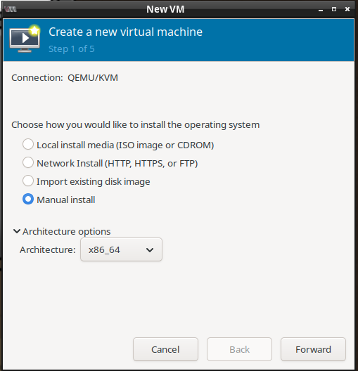

* Choose the operating system: generic Linux 2024 (Linux Mint isn't in the list), forward.

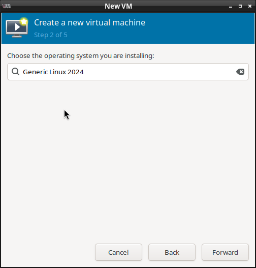

* Choose the amount of RAM and CPU's. Linux mint uses 1GB of ram just after install, so any amount above 2GB is fine. Make sure to leave some RAM for the host system. The number of CPU's can be the same as the amount of PCU of the host system. Forward.

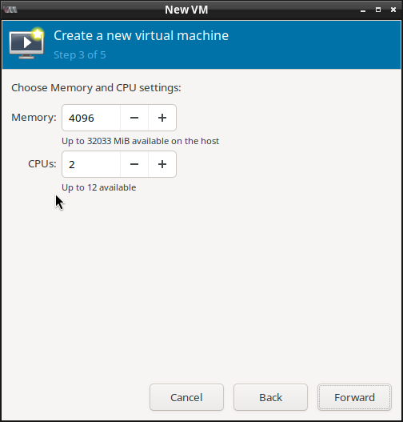

* [X] Create a disk image for this virtual machine. This disk can be choosen very large, as the host only stores the disk space that's actually used.
* Choose forward.

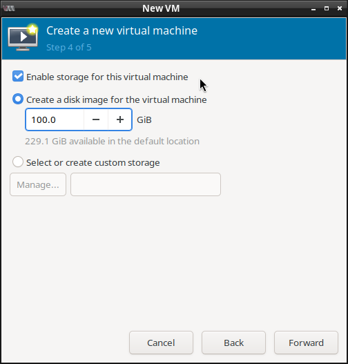

* Choose Finish.

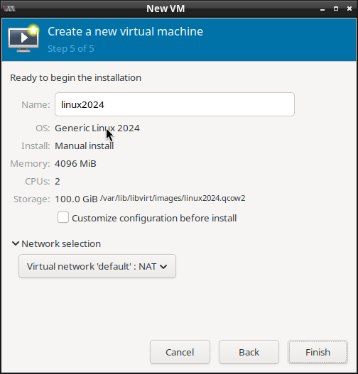

Now the virtual machine starts, and immediately reports "No bootable device". This is expected, as the virtual machine has no data on it's hard drive, and doesn't know about the ventoy memory stick yet.

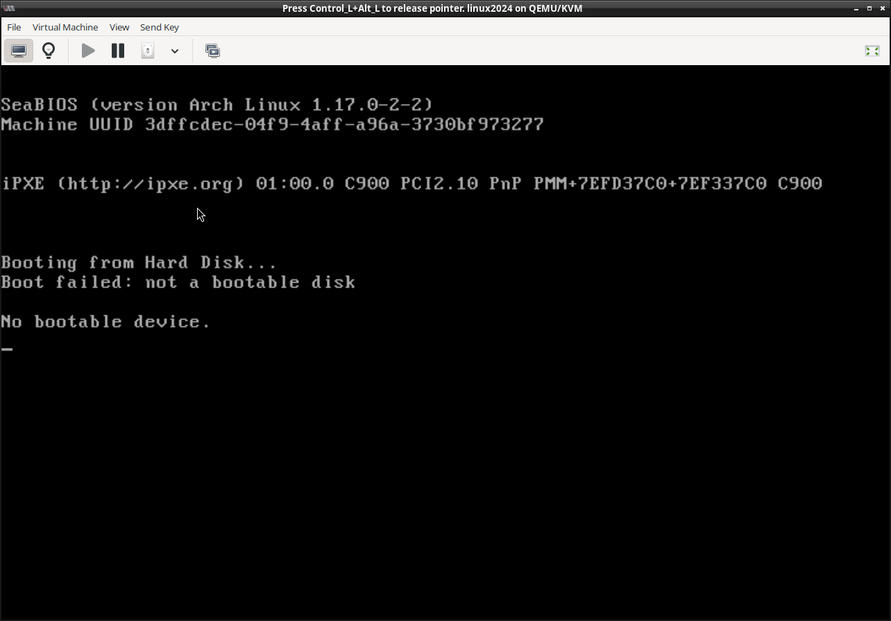

* Press left-ctrl and left-alt to release your mouse from the VM.

* Choose Virtual machine -> shut down -> force off.

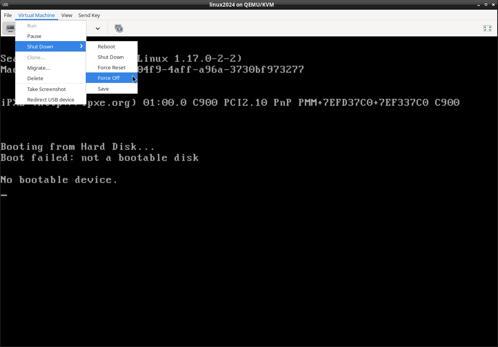

* Choose View -> details

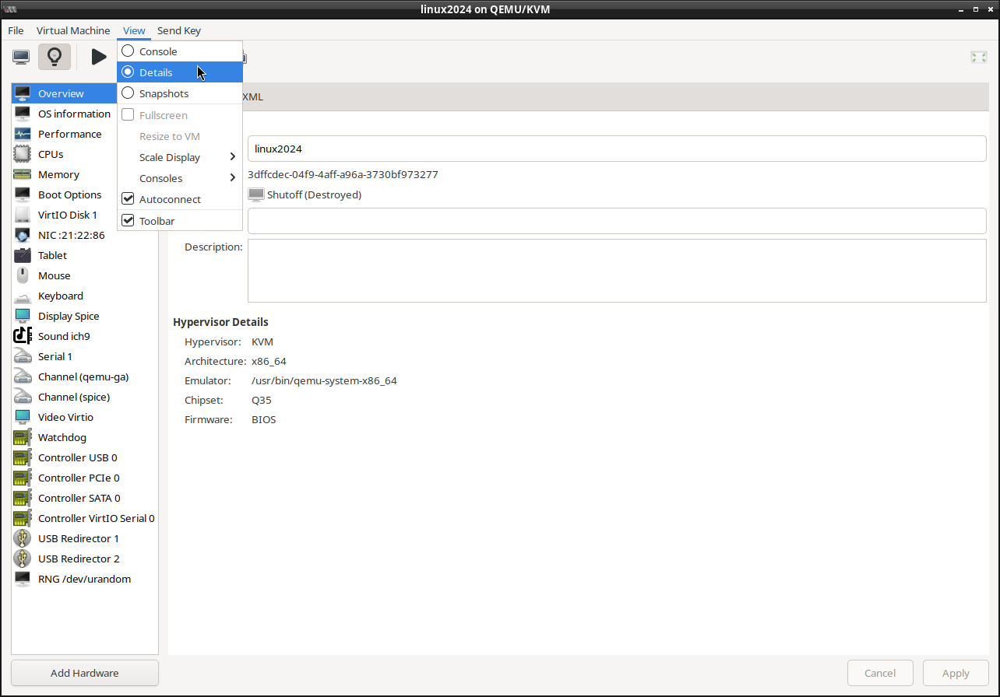

* Right-click on the list of hardware and choose add hardware -> USB Host Device, and select the memory stick, finish.

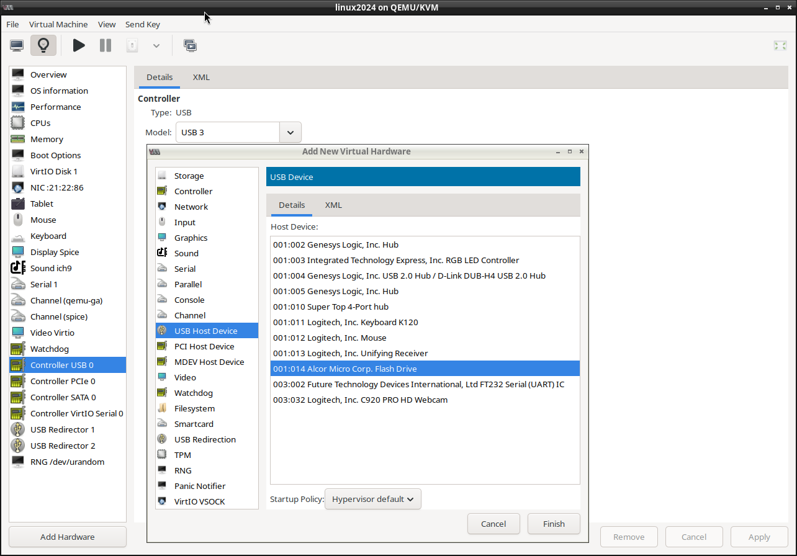

* Choose Boot options on the left, [X] enable USB xxxx:yyyy, and use the up arrow to move it at the top of the list, apply

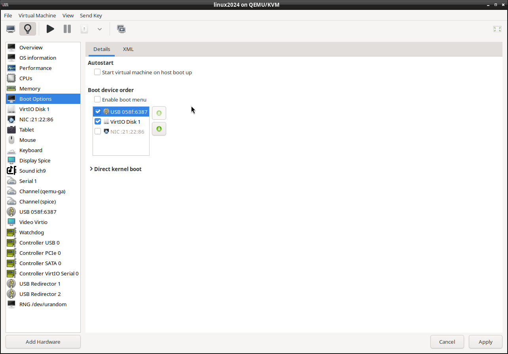

* Choose view -> console.
* Choose Virtual Machine -> run. Now the virtual PC boots from the memory stick

## The costs
An empty 100GB hard drive image takes 15.8MB

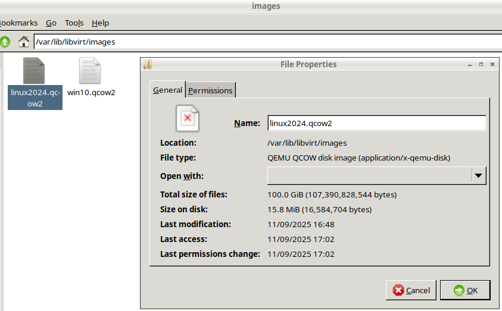

## The result
The virtual PC can now boot from a memory stick, and install an OS on it's harddrive.

## Reverting the change
Warning: This procedure will delete a virtual machine. This cannot be undone. Be sure to select the correct VM.

* Open Virtual Machine manager
* Right-click on the VM created above, and choose Delete. Also choose delete on its qcow2 virtual hard drive, and confirm you are sure.

# copyright
(c) Cedric de Wijs 2025

This page is licensed under the Creative Commons Attribution-NonCommercial 4.0 International license. You are free:
* to share – to copy, distribute and transmit the work
* to remix – to adapt the work

Under the following conditions:
* attribution – You must give appropriate credit, provide a link to the license, and indicate if changes were made. You may do so in any reasonable manner, but not in any way that suggests the licensor endorses you or your use.
* Non commercial – You may not use the material for commercial purposes.

See the file cc-by-nc-40.txt for details