# Install linux Mint #

## The problem
I want to run Linux Mint on my PC. Everything thatś currently on the SSD (or hard drive) can be deleted.

## The solution
Install Linux Mint on the PC.

## Getting help
There's also a forum for people running Linux Mint here:
[linuxmint.com](https://forums.linuxmint.com/)

There are a number of people who are willing to help with the installation of Windows Mint. you can find them here: [endof10.org](https://endof10.org/places/)

## The starting point
* A PC with an empty SSD. This PC is called the TargetPC. In this guide, a VM is used.
* A memory stick formatted with Ventoy. See [ventoy](ventoy.md.html) for details.

## The preparation
### Download Linux Mint
Download linuxmint-22.2-cinnamon-64bit.iso and sha256sum.txt from here: https://www.linuxmint.com/download.php 

Place both files on the memory stick.

### Verify the memory stick
Replug the memory stick into the PC, and enter the following commands:
```
$ cd /run/media/cedric/Ventoy/
Ventoy]$ sha256sum -c sha256sum.txt --ignore-missing
linuxmint-22.2-cinnamon-64bit.iso: OK
```
If the command states "OK", the memory stick can be used to install Linux.

## The procedure

### Boot targetPC from the memory stick
Warning: Make sure only the SSD where Linux mint has to be installed is connected to the target PC. This prevents installing Linux mint on the wrong drive.

Insert the memory stick in the target PC. Start the target PC. Press a special key on the keyboard repeatedly to enter the BIOS. On my PC this is the delete key. On other PC's this can be another key like F2 or F12. Next locate the boot order menu, and choose the USB stick

Some PC's also have a key to get a boot device menu, without entering the BIOS. On my PC this is F12.

When everything went well, you will be greeted by the Ventoy screen:


Press Enter to select linuxmint-22.2, and press enter again to choose "Boot in normal mode"

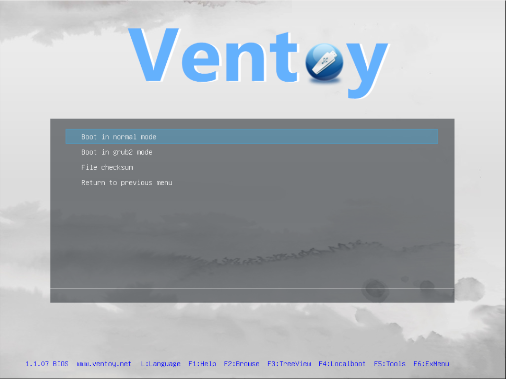

Next choose "Start Linux Mint"

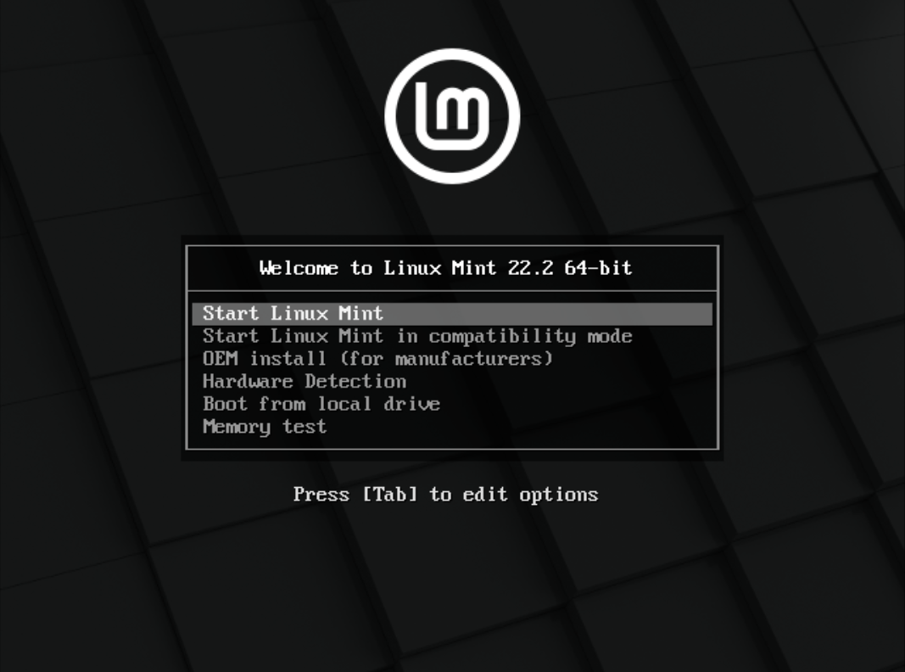

### Install Linux Mint
Warning: Make sure only the memory stick containing Ventoy, and the SSD where Linux mint has to be installed are connected to the target PC. This prevents installing Linux mint on the wrong drive.

After starting Linux Mint, double click "Install Linux Mint" to start the installation

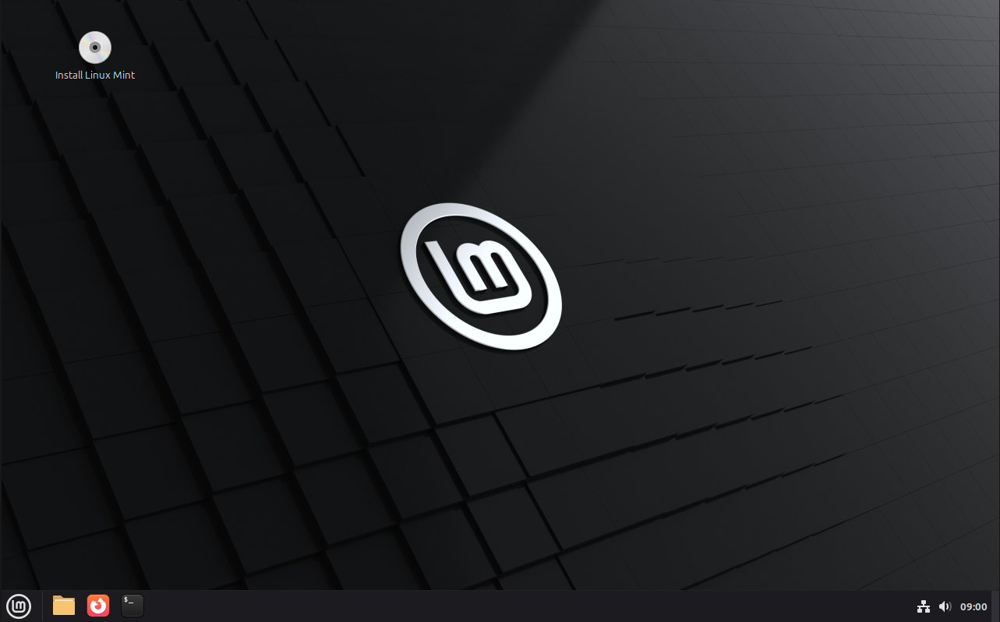

Choose the language and press continue (this guide uses English)

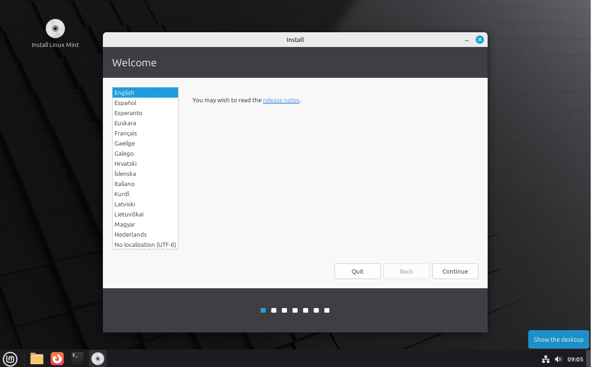

Choose the Keyboard Layout and press continue (this guide uses English (US))

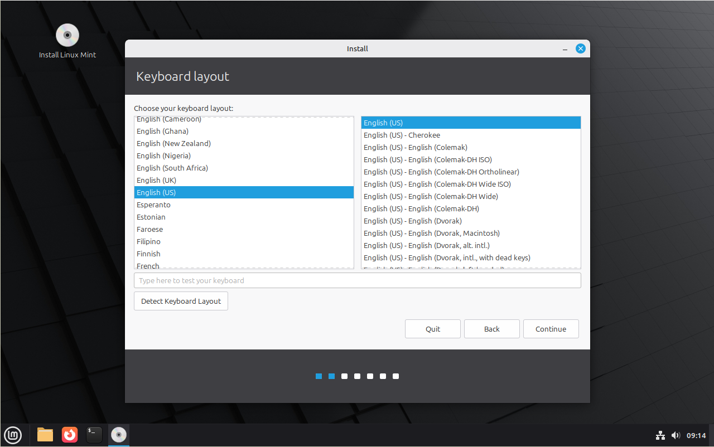

Enable the checkbox [X] Install Multimedia codex, and press continue

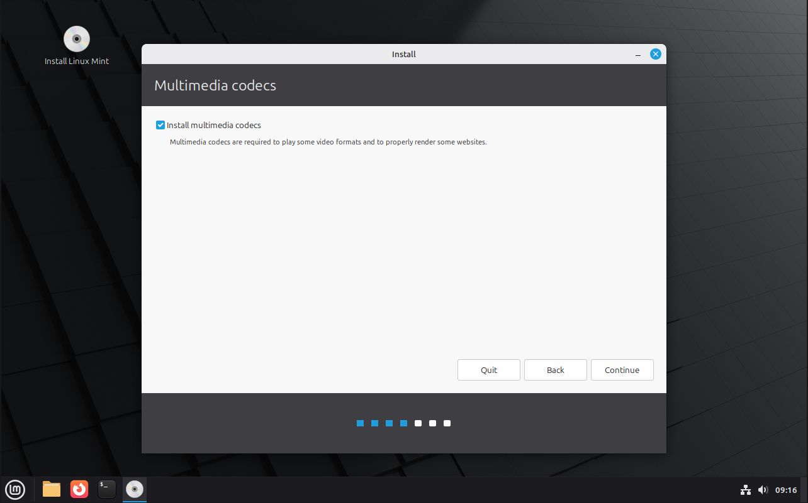

Warning: This step gives the installer of Linux Mint permission to erase everything thats currently on the ssd.

As the hard drive is completely empty, the Linux Mint installer does't see any other operation system, and doesn't offer the choice to install Linux next to the existing OS. Choose "Erase disk and install Linux Mint", and continue.

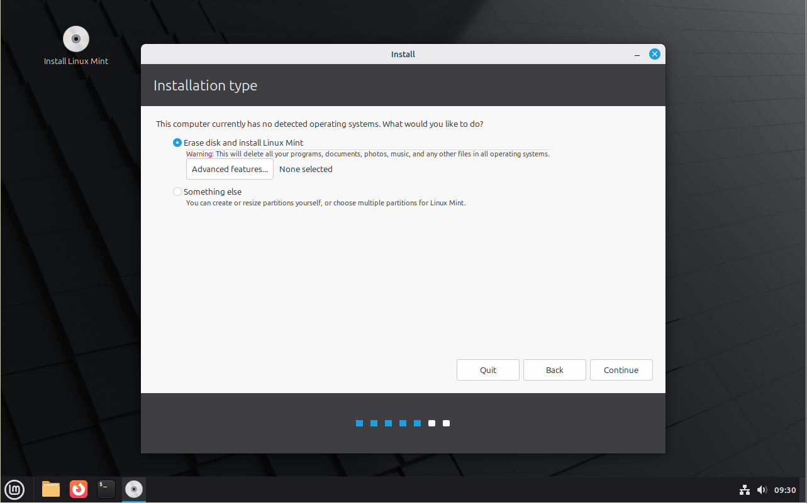

Warning: When the wrong drive is selected, it will be erased in the next step.

Select the correct drive and press "install now." (In this guide, a virtual SSD of 100GB is used):

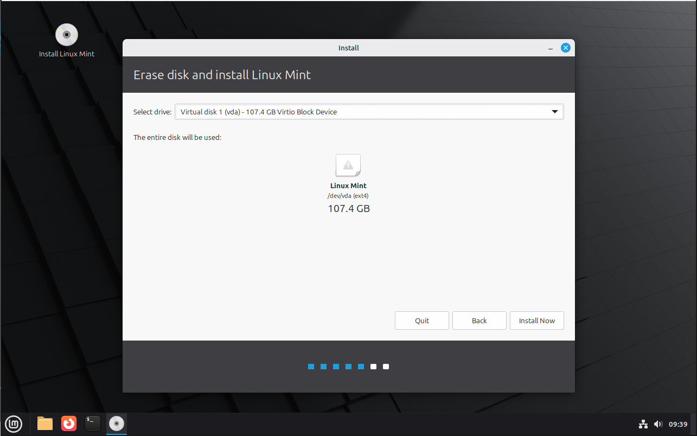

Warning: When "Continue" is pressed, the selected drive is erased. This cannot be undone.

Check if linux Mint will be installed on the correct drive and press continue

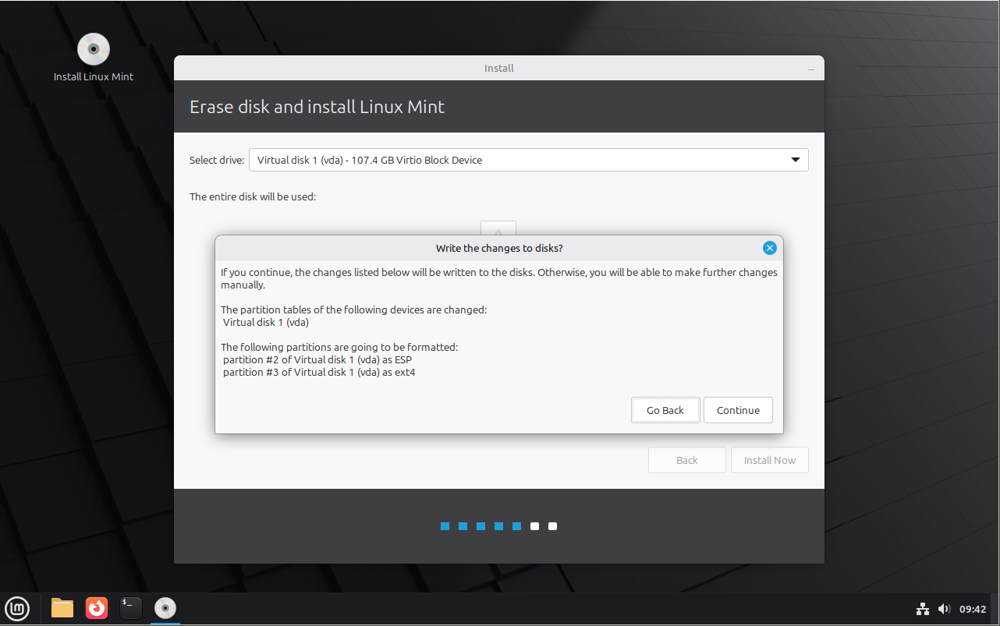

Specify what timezone must be used and press continue. (In this guide, Amsterdam is used):

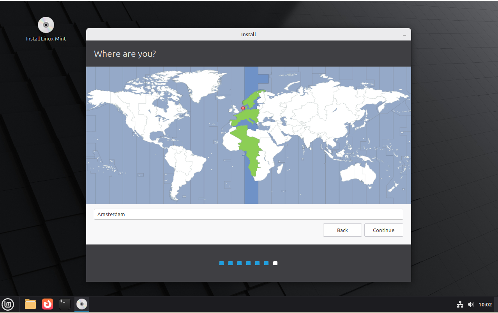

Warning: Make sureyou remember your password. if you forget the password, you cannot use your PC.

Enter the computername, your name and the password. and press continue

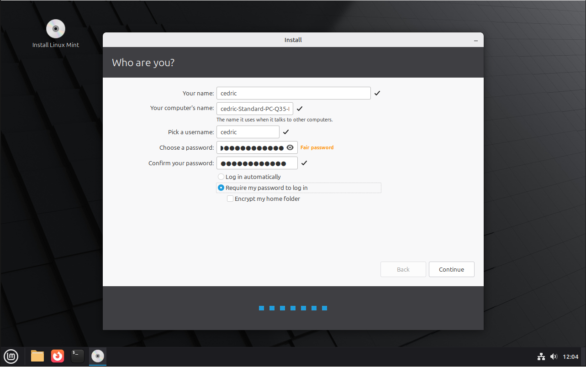

Now the installer installs Linux Mint on the target SSD

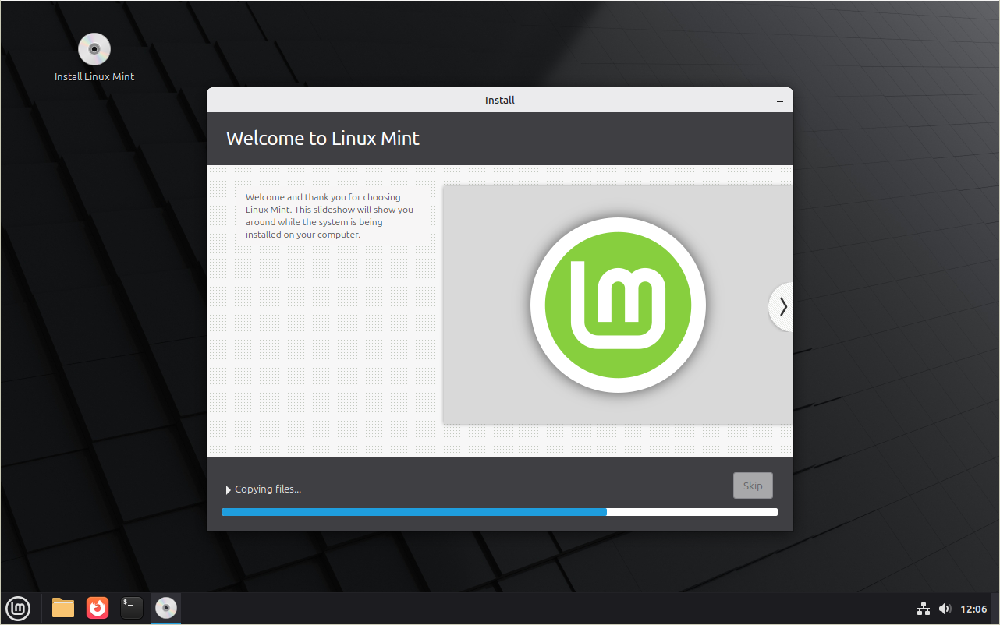

After some time, the installation is complete. Choose Restart Now.

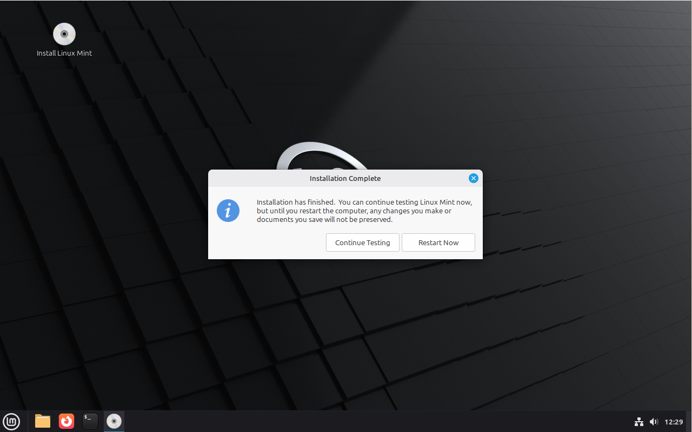

Finally, remove the memory stick and press enter

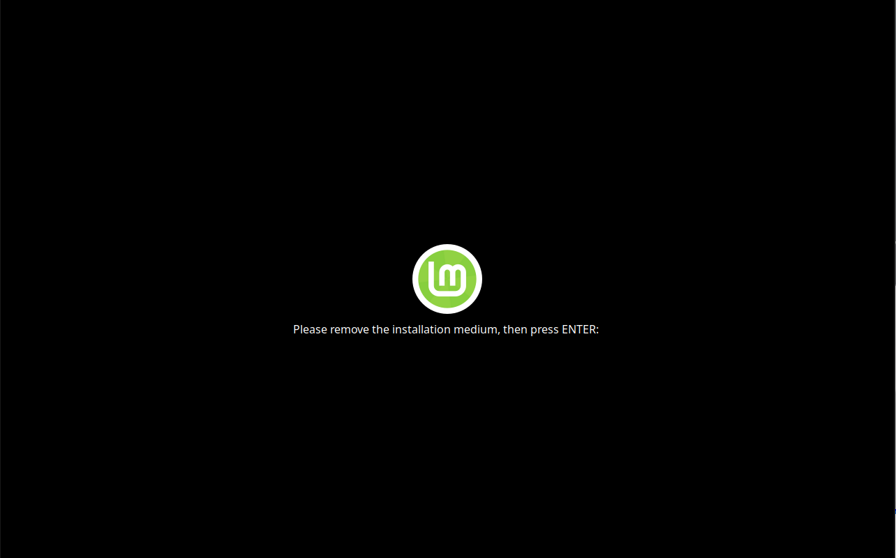

Now the machine reboots, and Linux Mint is started from the SSD

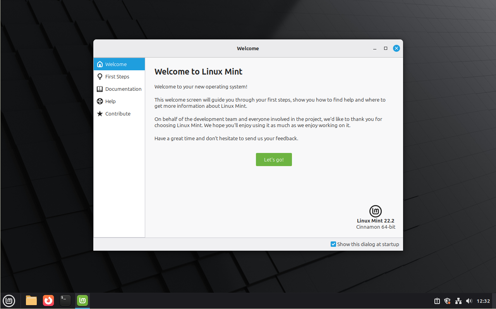

## The costs
Freshly installed, Linux Mint uses about 1016 of RAM and less than 12 GB of hard drive space.

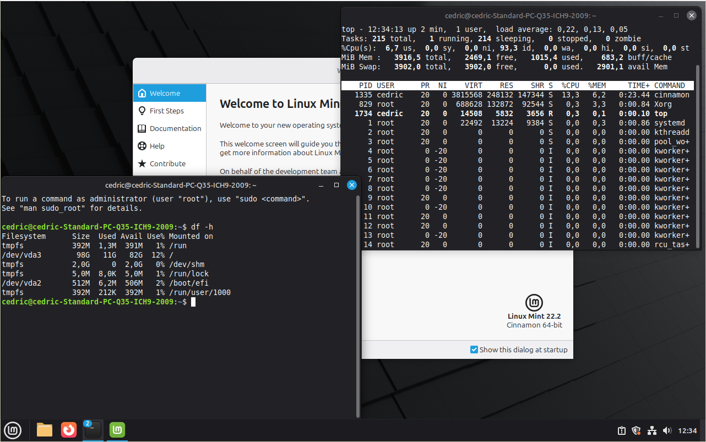

## The result
Linux Mint is installed on the SSD.

# copyright
(c) Cedric de Wijs 2025

This page is licensed under the Creative Commons Attribution-NonCommercial 4.0 International license. You are free:

* to share – to copy, distribute and transmit the work
* to remix – to adapt the work

Under the following conditions:

* attribution – You must give appropriate credit, provide a link to the license, and indicate if changes were made. You may do so in any reasonable manner, but not in any way that suggests the licensor endorses you or your use.
* Non commercial – You may not use the material for commercial purposes.

See the file cc-by-nc-40.txt for details