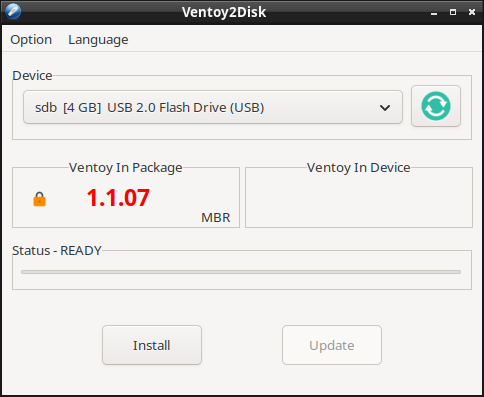
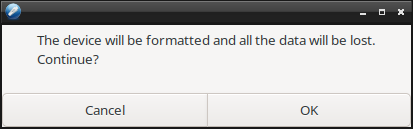
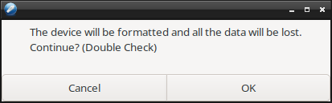
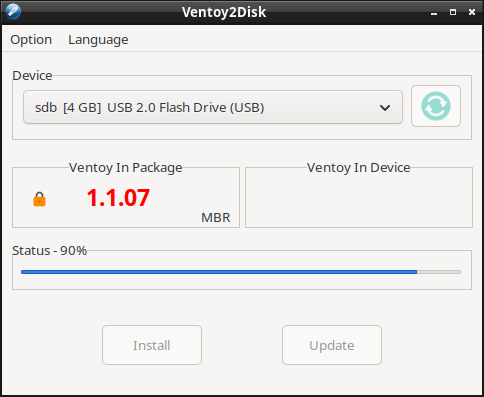
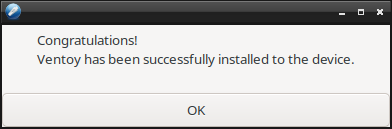
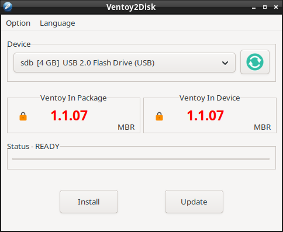
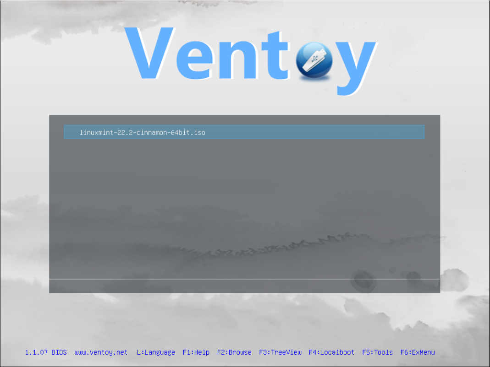

# Install ventoy on a memory stick #

## The problem

I would like to start (boot) my PC from an .iso file. Normally I would write that file to a CD or DVD, but my PC doesnt have a CD/DVD drive anymore.

## The solution

Most PC's can start from a memory stick. Vensoy writes a special program at the beginning of the memory stick. That program can then be used to select a .iso file, and boot from it.

## The starting point

* A PC running Windows or Linux.
* An empty memory stick, large enough to hold one or more .iso files.

### Download ventoy
Download Ventoy from here:
https://www.ventoy.net/en/index.html this links to https://sourceforge.net/projects/ventoy/files/ 
* Download ventoy-1.1.07-linux.tar.gz if the PC runs Linux
* Download ventoy-1.1.07-windows.zip if the PC runs Windows

## The procedure
### Download Ventoy using a Linux PC
Download Ventoy from here:
https://www.ventoy.net/en/index.html this links to https://sourceforge.net/projects/ventoy/files/ 
* Download ventoy-1.1.07-linux.tar.gz

### Start the Ventoy installer using a Linux PC
* Extract ventoy-1.1.07-linux.tar.gz with this command
```
tar -xvf ventoy-1.1.07-linux.tar.gz
```
* Start the installer with this command:
```
cd Ventoy
sudo VentoyGUI.x86_64
```

### Download Ventoy using a Windows PC
Download Ventoy from here:
https://www.ventoy.net/en/index.html this links to https://sourceforge.net/projects/ventoy/files/ 
* Download ventoy-1.1.07-windows.zip

### Start the Ventoy installer using a Windows machine:

### Install Ventoy on the memory stick
* Choose the correct device. The field "Ventoy in device" is empty, meaning Ventoy has not yet been installed on the memory stick.


* Click "Install". Now ventoy will ask for confirmation



Warning: Clicking OK will remove all information from the memory stick.

* Click OK. Now Ventoy will be installed on the memory stick.







After the format has been completed, ventoy is now installed on the memory stick



* place an iso file on the memory stick.
* Choose the memory stick as a boot device. If all went well, Ventoy now boots.



Optionally, also place ventoy-1.1.07-linux.tar.gz and ventoy-1.1.07-windows.zip on the memory stick, so everything is available to install Ventoy on another empty memory stick.

# copyright
(c) Cedric de Wijs 2025

This page is licensed under the Creative Commons Attribution-NonCommercial 4.0 International license. You are free:

* to share – to copy, distribute and transmit the work
* to remix – to adapt the work

Under the following conditions:

* attribution – You must give appropriate credit, provide a link to the license, and indicate if changes were made. You may do so in any reasonable manner, but not in any way that suggests the licensor endorses you or your use.
* Non commercial – You may not use the material for commercial purposes.

See the file cc-by-nc-40.txt for details