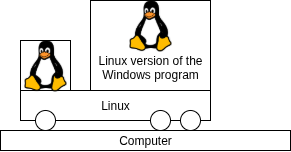
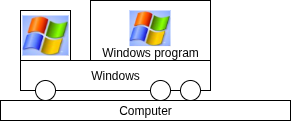
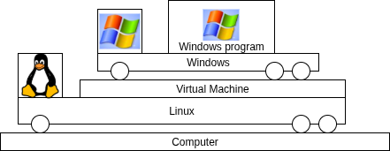
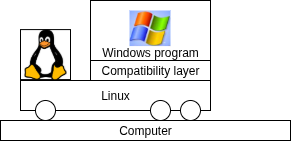

# Ways to run a Windows program

## Linux version of the Windows program on Linux
Sometimes the Windows program also has a Linux version. Then the Linux version can run directly on Linux. 

## On windows (Dual boot)
If all other methods fail, Windows can be installed next to Linux. The computer can now run either Windows, or Linux, but not both at the same time.

## On Windows (In a virtual machine)
Here the program runs on Windows, while Windows runs in a virtual machine (VM) on top of Linux.

## On Linux (In a compatibility layer)
Here the program runs on a compatibility layer. All the facilities the program uses are translated into Linux equvalents.

## An equivalent Linux program.
Sometimes a Program exists that does the sa